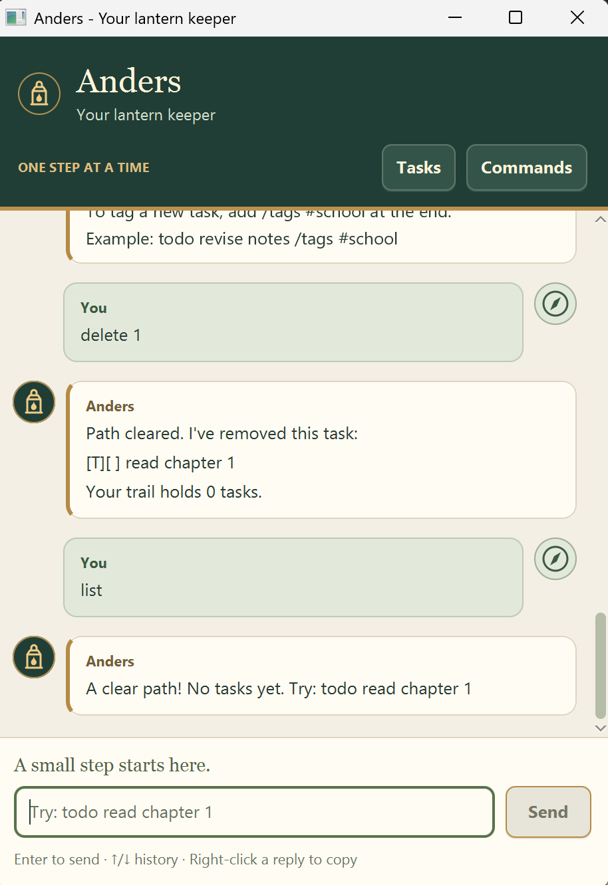

# Anders User Guide

**Anders is your lantern keeper:** a desktop task manager for keeping track of
todos, deadlines, and events through short typed commands. Mark tasks as done,
find them by description, and group them with reusable tags. Anders saves your
tasks locally so you can continue where you left off.



## Contents

- [Quick start](#quick-start)
- [Using the desktop window](#using-the-desktop-window)
- [Command reference](#command-reference)
- [Adding tasks](#adding-tasks)
- [Dates and times](#dates-and-times)
- [Viewing and finding tasks](#viewing-and-finding-tasks)
- [Completing and deleting tasks](#completing-and-deleting-tasks)
- [Managing tags](#managing-tags)
- [Saving your tasks](#saving-your-tasks)
- [Exiting Anders](#exiting-anders)
- [Troubleshooting](#troubleshooting)

## Quick start

The current build targets **Windows** and requires **JDK 25**. macOS and Linux
require JavaFX dependencies configured for their platform before building.

1. Install JDK 25 and make sure `java -version` reports version 25.
   Set `JAVA_HOME` to the JDK 25 installation if Gradle uses a different Java version.
2. Download and extract the source from the
   [Anders repository](https://github.com/anderschow/ip), or use your existing
   project folder.
3. Open a terminal in the project folder containing `gradlew.bat`.
4. Run the following command. The first run needs an internet connection to
   download Gradle and the project dependencies.

   ```powershell
   ./gradlew.bat run
   ```

5. When the Anders window opens, type each command below into the input box,
   pressing **Enter** after each one:

   ```text
   todo read chapter 1
   list
   mark 1
   ```

With an initially empty task list, the first command adds task 1, `list` shows it,
and `mark 1` marks it as done. If you already have tasks, use the new task's number
from `list` instead.

### Running a packaged JAR

To build a JAR from the project folder:

```powershell
./gradlew.bat shadowJar
```

This creates `build/libs/anders.jar`. Copy it into a folder where you want to keep
your tasks, open a terminal in that folder, and run:

```text
java -jar anders.jar
```

JDK 25 is still required. Start Anders from the same folder each time so it finds
the same saved tasks.

## Using the desktop window

- Type one command, then press **Enter** or click **Send**. Blank input is ignored.
- Click **Tasks** to list your tasks, or **Commands** for command formats and
  examples. Both buttons preserve any unfinished input.
- Press **Up** and **Down** in the input box to recall commands from the current
  session. Moving past the newest command restores your unfinished draft.
- Right-click a message and choose **Copy message** to copy its text.
- Resize the window or scroll through the conversation to read longer replies.
  New replies appear at their beginning.

## Command reference

Command words and clauses such as `todo`, `/by`, and `/tags` must be lowercase.
Replace placeholders such as `<task>` with your own text, leaving out the angle
brackets. Descriptions may contain spaces; quotation marks are unnecessary.

| Action | Command format | Example |
| --- | --- | --- |
| Add a todo | `todo <task>` | `todo read chapter 1` |
| Add a deadline | `deadline <task> /by <date>` | `deadline submit report /by 2/10/2026 1800` |
| Add an event | `event <task> /from <start> /to <end>` | `event study /from 2/10/2026 1400 /to 2/10/2026 1600` |
| List all tasks | `list` | `list` |
| Search descriptions | `find <text>` | `find chapter` |
| Mark as done | `mark <number>` | `mark 1` |
| Mark as not done | `unmark <number>` | `unmark 1` |
| Delete a task | `delete <number>` | `delete 1` |
| Add tags | `tag <number> #<tag>` | `tag 1 #school #reading` |
| Remove tags | `untag <number> #<tag>` | `untag 1 #reading` |
| Search an exact tag | `find #<tag>` | `find #school` |
| Say goodbye | `bye` | `bye` |

You can supply multiple space-separated tags to `tag` and `untag`.
To tag a task when adding it, append `/tags #<tag>` to any task-creation command.
The `/tags` clause must come last and contain at least one valid tag.

**Task numbers start at 1.** Use a number shown by `list` or `find`, up to the
current task count. For example, with two tasks, either 1 or 2 is valid.
`list` and `bye` take no additional arguments.

## Adding tasks

All new tasks start as not done and are appended to the end of your list.
The examples below show the task line in Anders's reply; it also confirms the
addition and reports the total task count.

### Todos

Use a todo for a task without a due date.

```text
todo read chapter 1
```

Task added:

```text
[T] read chapter 1
```

### Deadlines

Use a deadline for a task due on a particular date, optionally with a time.
Include a description and a `/by` value.

```text
deadline submit report /by 2/10/2026 1800
```

Task added:

```text
[D] submit report (by: Oct 02 2026 6.00 pm)
```

### Events

Use an event for an activity with a start and an end. Include a description,
then `/from` and `/to` in that order.

```text
event study group /from 2/10/2026 1400 /to 2/10/2026 1600
```

Task added:

```text
[E] study group (from: Oct 02 2026 2.00 pm to: Oct 02 2026 4.00 pm)
```

The end must be at or after the start. An event can span multiple days.

## Dates and times

Slash-separated dates use **day/month/year**: `2/10/2026` means **2 October 2026**.
Times use the 24-hour clock: `0900` means 9 am and `1800` means 6 pm.

| Input format | Example | Accepted for |
| --- | --- | --- |
| `d/M/yyyy` | `2/10/2026` | Deadlines and events |
| `d/M/yyyy HHmm` | `2/10/2026 1800` | Deadlines and events |
| `yyyy-MM-dd` | `2026-10-02` | Deadlines and events |
| `yyyy-MM-dd HHmm` | `2026-10-02 1800` | Deadlines and events |
| `yyyy-MM-dd HH:mm` | `2026-10-02 18:00` | Deadlines and events |

Use real calendar dates and times from `0000` to `2359` for `HHmm`.
Natural-language dates such as `tomorrow` are not accepted. All five formats above
work for both deadlines and events.

A date without a time is displayed without a time. When comparing an event's
start and end, a date-only value is treated as midnight at the start of that day.
The examples in this guide show English month abbreviations; month names may
follow your system locale.

## Viewing and finding tasks

### Listing tasks

Enter `list` or click **Tasks** to show every task, including completed tasks,
in the order they were added. After adding the three example tasks above to an
empty list, `list` includes:

```text
1.[T][ ] read chapter 1
2.[D][ ] submit report (by: Oct 02 2026 6.00 pm)
3.[E][ ] study group (from: Oct 02 2026 2.00 pm to: Oct 02 2026 4.00 pm)
```

`[T]`, `[D]`, and `[E]` identify todos, deadlines, and events.
`[ ]` means not done; `[X]` means done. Tags appear at the end of a task line,
for example `(tags: #school #reading)`.

If the list is empty, Anders replies:

```text
A clear path! No tasks yet. Try: todo read chapter 1
```

### Searching descriptions

Use `find <text>` to search for a case-insensitive substring in task descriptions.

```text
find CHAPTER
```

This matches `read chapter 1`. A phrase such as `find study group` searches for
that whole phrase. Description searches do not search dates or tags.

Search results keep their **original task numbers**. If `find report` shows
task 2, use `mark 2` to complete it, even if it is the only result.
If nothing matches, Anders reports `No matching tasks found. Try another word or #tag.`

### Searching tags

Use `find #<tag>` to search for one exact tag:

```text
find #SCHOOL
```

This finds all tasks tagged `#school`, regardless of case. It does not match
`#schoolwork`. Only one tag can be searched at a time.

## Completing and deleting tasks

### Marking and unmarking

Use `mark <number>` to complete a task. For example, after adding
`todo read chapter 1` as task 1:

```text
mark 1
```

Anders replies:

```text
One more light along the path. Task marked as done:
  [X] read chapter 1
```

The task remains in your list. Use `unmark 1` to make it not done again.

### Deleting

Use `delete <number>` to remove a task, for example:

```text
delete 1
```

Anders confirms the removed task and the remaining task count. Deletion takes
effect immediately, with no confirmation prompt or undo command.
Run `list` again afterwards because the remaining tasks are renumbered.

## Managing tags

Tags group related tasks, and the same tag can be shared by any number of tasks.

### Tagging new tasks

Append a trailing `/tags` clause:

```text
todo read book /tags #fun #school
deadline return book /by 2/10/2026 /tags #admin
event project meeting /from 2/10/2026 1400 /to 2/10/2026 1600 /tags #project #meeting
```

The first task appears in `list` as:

```text
[T][ ] read book (tags: #fun #school)
```

### Updating existing tags

Add one or more tags to an existing task:

```text
tag 1 #fun #school
```

Remove one or more tags:

```text
untag 1 #school
```

Adding a tag already on that task does not create a duplicate. Removing a tag
that is absent leaves the task unchanged. Neither command changes other tasks
that share the tag.

### Tag rules

- Start each tag with `#`, followed by at least one character.
- Use only English letters (`A-Z`, `a-z`), digits, hyphens, or underscores.
- Separate multiple tags with spaces. Spaces cannot be part of a tag.
- Tags are case-insensitive and stored in lowercase: `#School` becomes `#school`.

For example, `#school`, `#cs2103t`, and `#read-later` are valid.
`school`, `#`, and `#fun!` are invalid.
A command containing an invalid tag is rejected without changing any tasks.

## Saving your tasks

Anders automatically saves task additions, completion changes, deletions, and
tag changes to `data/anders.txt`, relative to the folder from which it runs.
For `./gradlew.bat run`, this is the project folder.

The file and its parent directory are created on the first successful save.
Tasks, dates, completion status, and tags are loaded on the next launch.
The conversation and command history are only kept for the current session.

To back up your tasks, close Anders and copy `data/anders.txt` to a safe location.
To restore a backup or move to another computer, close Anders and place the
backup at `data/anders.txt` in the folder you will launch from.
Use the app's commands to change tasks; manually editing the save file can make
records unreadable.

If Anders reports a save failure, your changes are available only in the current
session until a save succeeds. See [Troubleshooting](#troubleshooting) before
closing the app.

## Exiting Anders

Close the desktop window using its **X** button. Task changes are saved as you
make them, so a separate save command is unnecessary.

The `bye` command displays:

```text
Rest well, wanderer. I'll keep the lantern lit.
```

In the desktop window, this message leaves the window open. In console mode,
`bye` ends the session. To use console mode with a packaged JAR, run
`java -cp anders.jar anders.Anders` from the folder containing it.

## Troubleshooting

| Problem | What to do |
| --- | --- |
| The app will not start, or reports an unsupported Java/class version. | Check `java -version` and `JAVA_HOME`; use JDK 25. The current JavaFX build targets Windows. |
| Anders does not recognise a command. | Use a lowercase command from the reference, supply its required arguments, and enter one command at a time. Click **Commands** for examples. |
| A task number is rejected. | Run `list` and choose a current whole number from 1 to the task count. Add a task first if the list is empty. |
| A date or event range is rejected. | Check the [accepted formats](#dates-and-times), the calendar date, and the time. An event must end at or after it starts. |
| A tag is rejected. | Include `#`, use only allowed characters, and put a nonempty `/tags` clause last when creating a task. |
| Tasks seem to have disappeared after restarting. | Check that you launched from the same folder and that its `data/anders.txt` exists. |
| Anders reports skipped invalid saved records. | Valid records still load. Back up the file before making further changes, then check for missing tasks and restore a known good backup if available. |
| Anders could not read the data file. | Saving is disabled for that session to protect existing data. Check the data path and read permissions, then restart. |
| Anders could not save tasks. | Check that the data folder is writable. After fixing the problem, make another task change to retry saving before closing. If a startup read failure disabled saving, fix that problem and restart instead. |
